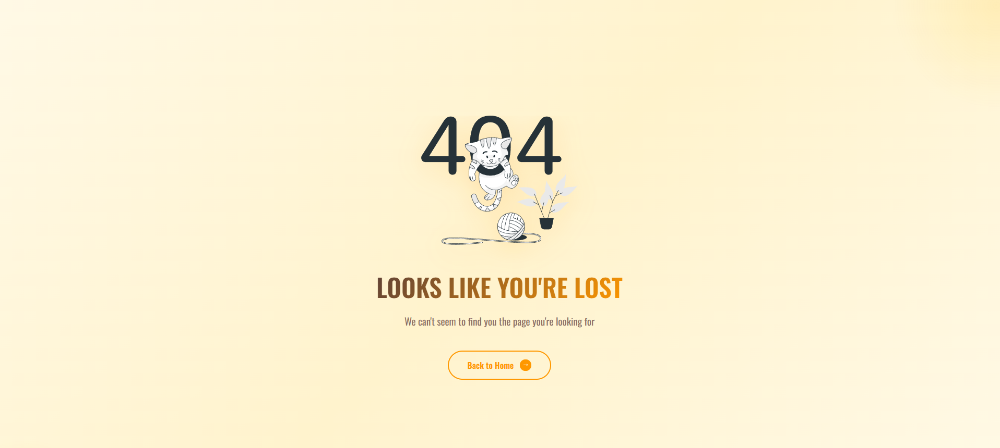

<h1 align="center">
🍽️ HARSHUZZ – Mini Food Reservation App
</h1>

<p align="center">
A modern, responsive food reservation and menu application built using the 
<strong>MERN Stack (MongoDB, Express, React, Node.js)</strong>.<br/>
Users can browse dishes, add items to the cart, and reserve tables seamlessly.
</p>

<p align="center">
<strong>React 19 (Vite)</strong> • <strong>Node.js & Express</strong> • <strong>MongoDB</strong> • <strong>MIT License</strong>
</p>

<p align="center">
<a href="#-about">About</a> •
<a href="#-features">Features</a> •
<a href="#-technologies-used">Tech Stack</a> •
<a href="#-folder-structure">Structure</a> •
<a href="#-installation--setup">Installation</a> •
<a href="#-usage">Usage</a> •
<a href="#-screenshots">Screenshots</a> •
<a href="#-contributing">Contributing</a> •
<a href="#-license">License</a>
</p>

---

## 🚀 About

**HARSHUZZ** is a mini food reservation app that showcases a restaurant menu with smooth UI animations and interactive experiences.  
The app is a full **MERN stack project**, covering:

- UI/UX design  
- API creation  
- State management  
- Database integration  

### **Key Capabilities**

- 🍕 **Interactive Menu** — Filter dishes by categories like Starters, Mains, Desserts, Drinks  
- ⭐ **Popular Items Highlight** — Eye-catching badges for top dishes  
- 📅 **Reservation Form** — Reserve a table and store data in MongoDB  
- 📱 **Fully Responsive** — Optimized for mobile and desktop  

---

## ✨ Features

| Feature | Description | Emoji |
|--------|-------------|-------|
| **Category Filters** | Navigate dishes by category | 🗂️ |
| **Popular Dish Badge** | Highlights best-selling items | ⭐ |
| **Smooth Scrolling** | Fluid transitions between sections | 🎯 |
| **Modern Animations** | Framer Motion micro-interactions | ✨ |
| **RESTful API** | Express/Node backend for reservations & menu | 🔗 |

---

## 🛠️ Technologies Used

### **Full Stack**
- MERN Stack: **MongoDB • Express • React • Node.js**

### **Frontend**
| Technology | Purpose |
|-----------|---------|
| React 19 + Vite | Fast, modern UI setup |
| Framer Motion | Smooth animations |
| React Router DOM | Navigation |
| React Hot Toast | Notifications |

### **Backend**
| Technology | Purpose |
|-----------|---------|
| Node.js + Express | API and server |
| MongoDB + Mongoose | Data modeling & storage |
| CORS | Cross-origin requests |
| Dotenv | Environment variable management |

---

## 📂 Folder Structure
```
Mini-Food-Reservation-App/
├── backend/ # Node.js / Express Server
│ ├── models/ # MongoDB Schemas
│ ├── routes/ # API routes
│ ├── controllers/ # Business logic
│ ├── .env.example # Environment variable guide
│ └── server.js # Server entry
└── frontend/ # React + Vite
├── src/
│ ├── components/ # UI components
│ ├── pages/ # Screens
│ ├── context/ # Global context (CartContext)
│ └── App.jsx # Main component
└── package.json # Dependencies
```

---

## 📦 Installation & Setup

### **Prerequisites**
- Node.js (LTS recommended)  
- npm or yarn  
- MongoDB (local or Atlas cloud)  

### **1. Clone the Repository**


```sh
git clone https://github.com/Harshitdongarwar2528/Mini-Food-Reservation-App.git
cd Mini-Food-Reservation-App
2. Setup Environment Variables
Create a new .env file inside backend/:

ini
Copy code
# backend/.env
MONGODB_URI=mongodb://localhost:27017/harshuzz-restaurant
PORT=4000
CLIENT_URL=http://localhost:5173
```
3. Install Dependencies
Frontend:

```sh
Copy code
cd frontend
npm install
```
Backend:

```sh
Copy code
cd ../backend
npm install
```
4. Run the Project
Start Backend:

```sh
Copy code
npm run dev
```
# Server will run at http://localhost:5000
Start Frontend:

```sh
Copy code
cd ../frontend
npm run dev
```
# App will run at http://localhost:5173
💡 Usage
Explore the restaurant menu

Filter dishes by category

Add items to your cart

Submit a reservation form

All data is stored in MongoDB

## 📸 Screenshots

<div align="center">

**Hero/Home Page**  


**Reservation Page**  


**404 Not Found Page**  


</div>
🤝 Contributing
Fork the repository

Create a feature branch:

sh
Copy code
git checkout -b feature/AmazingFeature
Commit your changes:

sh
Copy code
git commit -m "Add AmazingFeature"
Push the branch:

sh
Copy code
git push origin feature/AmazingFeature
Open a Pull Request

📜 License
This project is licensed under the MIT License.

<p align="center">Made with ❤️ by <strong>Harshit Dongarwar</strong></p>
